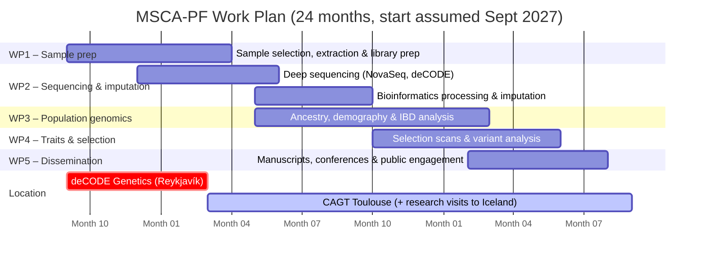

# Part B-1 — Section 3: Implementation

*First draft — preliminary. To be revised after review by Sunna and Hannes.*
*Target length: ~3 pages in final formatted document.*

---

## 3.1 Work Plan

The project runs for **24 months**, divided into five work packages (WPs). The first six months are based at deCODE Genetics, Reykjavík, to carry out sampling and laboratory work; months 7–24 are based at CAGT, University of Toulouse, with research visits to deCODE and the National Museum of Iceland as needed.

### Work Packages

**WP1 — Sample selection, extraction, and library preparation** (Months 1–7)

The project opens with an intensive laboratory phase at deCODE Genetics. Drawing on the existing permission for 22 settlement-era specimens and the pending expanded permission covering up to 90 specimens, Sunna will assess available bone and tooth material at the National Museum of Iceland, select the optimal specimens for aDNA work, and carry out DNA extraction and library preparation. Existing sequencing libraries for 7 samples (VHR031, VHR085, VHR089, VHR093, VHR100, VHR102, VHR105) will be assessed and incorporated. Initial shallow sequencing (MiSeq) will be used to screen all libraries for endogenous DNA content before committing samples to deep sequencing.

*Milestone M1.1* (Month 3): At least 30 libraries prepared and quality-assessed.
*Milestone M1.2* (Month 7): All libraries prepared; samples selected for deep sequencing.

**WP2 — Sequencing, bioinformatic processing, and imputation** (Months 4–14)

Deep sequencing will be performed on the Illumina NovaSeq platform at deCODE Genetics (Months 4–10). Bioinformatic processing — adapter trimming, mapping to EquCab3, deduplication, mapDamage rescaling — will run in parallel with sequencing. Samples meeting the quality threshold (>1% endogenous, characteristic damage patterns) will be imputed using GLIMPSE2 and the Orlando lab reference panel at CAGT (Months 10–14). This WP bridges the two host institutions and will involve close coordination with the Orlando laboratory.

*Milestone M2.1* (Month 10): At least 50 mapped and quality-filtered genomes available.
*Milestone M2.2* (Month 14): Full imputed dataset assembled; ready for population genomic analysis.

**WP3 — Population structure and ancestry analysis** (Months 10–20)

Using the imputed dataset, Sunna will carry out the analyses addressing Objectives 1 and 2: PCA, ADMIXTURE, f-statistics, admixture graph modelling, IBD analysis, ROH quantification, and demographic modelling. Results will be interpreted against the Orlando laboratory's global horse reference dataset. This WP will run partly in parallel with WP2, beginning as the first imputed genomes become available.

*Milestone M3.1* (Month 16): Preliminary ancestry and demographic results; internal seminar presentation at CAGT.
*Milestone M3.2* (Month 20): Complete population genomic analysis; first manuscript drafted.

**WP4 — Selection scans and trait-associated variant analysis** (Months 14–22)

Genome-wide selection scans will identify signatures of adaptation specific to the Icelandic lineage. Targeted analysis of known functional variants (DMRT3, coat colour loci, metabolic and immune-related variants) will characterise the evolution of the breed's distinctive traits under isolation. This WP addresses Objective 3 and will draw on expertise in the Orlando laboratory in horse functional genomics.

*Milestone M4.1* (Month 20): Selection scan results complete.
*Milestone M4.2* (Month 22): Second manuscript drafted.

**WP5 — Dissemination and communication** (Months 18–24)

Final manuscript preparation, conference presentations, public engagement activities, and data deposition. Both primary research articles are submitted to peer-reviewed journals. Genomic data are deposited in ENA; pipelines released on GitHub.

*Milestone M5.1* (Month 22): Both manuscripts submitted.
*Milestone M5.2* (Month 24): All data deposited; public engagement activities completed.

---

### Gantt Chart

---

## 3.2 Risk Assessment

| Risk | Likelihood | Impact | Mitigation |
|---|---|---|---|
| Low endogenous DNA yield from some specimens | Medium | Medium | Large initial sample pool (up to 90 specimens); existing 7 libraries with confirmed yield; National Museum backup list provides additional candidates |
| Delayed access to remaining National Museum samples | Low | Medium | 22 specimens already permitted; sampling proposal for remaining specimens submitted in parallel with this application; curator has indicated further permission will be granted |
| Orlando letter of support delayed | Low | High | Active ongoing collaboration; pre-existing relationship between deCODE group and CAGT makes this unlikely; contingency: alternative host institution if needed |
| Imputation quality insufficient for low-coverage samples | Low | Medium | GLIMPSE2 has been validated for ancient horse genomes at 0.5–2× coverage using this reference panel; fallback: pseudohaploid calling for individuals with very low coverage |
| Delays in sequencing pipeline at deCODE | Low | Low | deCODE operates its own Illumina sequencing facility with substantial capacity; samples can be outsourced to external providers if needed |
| Data deposition restrictions from deCODE | Low | Medium | Standard deCODE data sharing protocols apply; genomic data from horse specimens do not fall under human data protection rules; will be confirmed before submission |

---

## 3.3 Resources

**Host institution infrastructure**

The CAGT (Centre for Anthropobiology and Genomics of Toulouse) provides:
- Prof. Orlando's group with dedicated expertise in ancient horse genomics and the comparative reference panel
- High-performance computing infrastructure for large-scale genomic analyses
- Bioinformatic support staff
- Access to CNRS and University of Toulouse research support services

**Applicant's institutional resources**

Through the ongoing collaboration with deCODE Genetics, Reykjavík, Dr Ebenesersdóttir will retain access to:
- The dedicated aDNA clean-room laboratory at deCODE (established and maintained by the applicant)
- Illumina sequencing infrastructure (NovaSeq, HiSeq, MiSeq)
- The deCODE biobank and population genomic databases for comparative analyses
- The National Museum of Iceland horse specimen collection

**Equipment and consumables**

Standard molecular biology consumables (extraction kits, library preparation reagents, sequencing reagents) will be budgeted within the MSCA fellowship grant. No major equipment purchases are required; all key instruments are already available at the host and partner institutions.

**Secondments and research visits**

The project design includes regular visits between Toulouse and Reykjavík to ensure continuity of laboratory access and collaboration. A total of [X] months of research visits to deCODE Genetics and the National Museum of Iceland are planned and budgeted within the fellowship.
